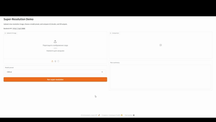

# sr_pet_project



## Описание

`sr_pet_project` — это проект для super-resolution на изображениях с воспроизводимым пайплайном обучения, оценки, инференса и упаковки в сервис. В репозитории уже собраны конфиги, скрипты и артефакты для запуска baseline-моделей, сравнения качества восстановления и разворачивания демо через API и Gradio.

Проект устроен как набор независимых, но совместимых этапов:

- обучение модели по YAML-конфигу;
- оценка качества на валидационном наборе;
- сохранение визуализаций и метрик;
- экспорт модели в ONNX;
- замер latency;
- запуск FastAPI-бэкенда для инференса;
- запуск Gradio-демо поверх API.

По умолчанию проект работает с датасетом `DeepRockSR-2D`, который уже ожидается в корне репозитория, а результаты экспериментов складывает в `outputs/`.

## Возможности

- Поддержка нескольких сценариев работы: train, evaluate, visualize, export, benchmark, serve, demo.
- Единый конфигурационный подход через YAML-файлы в каталоге `configs/`.
- Воспроизводимое обучение с фиксируемым `seed`, настройками оптимизатора, scheduler, loss и device.
- Поддержка метрик `PSNR` и `SSIM` при валидации и финальной оценке.
- Сохранение checkpoint-файлов (`best` и `last`) и TensorBoard-логов.
- Генерация comparison grid для сравнения LR, bicubic и SR-результата.
- Экспорт обученных моделей в ONNX с опциональной проверкой через `onnx` и `onnxruntime`.
- Замер latency для подготовленной модели и сохранение результатов в JSON.
- FastAPI-сервис с готовыми эндпоинтами `/health`, `/presets` и `/predict`.
- Gradio-интерфейс, который умеет работать поверх локального API и показывать сравнение LR / Bicubic / SR.
- Отдельные Docker-сценарии для CPU и CUDA.

## Модели

В проекте используются три типа моделей:

- `bicubic` — базовый интерполяционный апскейл без обучения; используется как baseline для визуального и количественного сравнения.
- `cnn` — сверточная модель `RLFN`, ориентированная на быстрый и относительно легкий SR baseline.
- `swinir` — трансформерная модель `SwinIR`, рассчитанная на более сильное качество восстановления при большей вычислительной стоимости.

Готовые пресеты для инференса описаны в `configs/demo_inference.yaml`:

- `CNN x2`
- `CNN x4`
- `SwinIR x2`
- `SwinIR x4`

Практически это означает следующее:

- CNN-пресеты работают с одноканальными изображениями (`L`).
- SwinIR-пресеты в демо загружаются как `RGB`.
- Для SwinIR используется `crop_multiple: 8`, поэтому API при необходимости автоматически центрирует входное изображение под ограничения модели.

Основные конфиги обучения:

- `configs/train_cnn.yaml`
- `configs/train_swinir.yaml`

Основные конфиги для ONNX/latency:

- `configs/benchmark_cnn.yaml`
- `configs/benchmark_swinir.yaml`

## Структура

Ниже приведена логическая структура проекта:

```text
sr_pet_project/
├─ app/                     # Gradio demo
├─ configs/                 # YAML-конфиги обучения, демо и benchmark/export
├─ DeepRockSR-2D/           # датасет
├─ outputs/                 # checkpoints, visualizations, tensorboard, benchmark, onnx
├─ scripts/                 # CLI entrypoints
├─ src/
│  ├─ api/                  # FastAPI inference service
│  ├─ benchmark/            # latency benchmark
│  ├─ data/                 # datasets, dataloaders, transforms
│  ├─ eval/                 # evaluation и visualizations
│  ├─ export/               # ONNX export
│  ├─ models/               # bicubic, CNN, SwinIR, factory, loading
│  ├─ runtime/              # device helpers
│  └─ train/                # training loop и trainer
├─ docker-compose.yml
├─ docker-compose.cuda.yml
├─ Dockerfile
├─ Dockerfile.cuda
└─ requirements.txt
```

CLI-скрипты проекта:

- `scripts/train.py` — обучение.
- `scripts/evaluate.py` — расчет метрик и экспорт результатов в JSON.
- `scripts/visualize.py` — сохранение comparison grid.
- `scripts/export_onnx.py` — экспорт модели в ONNX.
- `scripts/benchmark.py` — замер latency.
- `scripts/serve.py` — запуск FastAPI API.
- `app/demo.py` — запуск Gradio demo.

## Запуск через CLI

### 1. Установка зависимостей

Рекомендуемая базовая установка:

```bash
python -m venv .venv
source .venv/bin/activate
pip install --upgrade pip
pip install -r requirements.txt
```

Для Windows PowerShell:

```powershell
python -m venv .venv
.venv\Scripts\Activate.ps1
pip install --upgrade pip
pip install -r requirements.txt
```

Перед запуском убедитесь, что:

- каталог `DeepRockSR-2D/` доступен в корне репозитория;
- нужные checkpoint-файлы находятся в `outputs/.../checkpoints/`;
- в конфиге указан корректный `device` (`cpu`, `cuda`, `cuda:0`).

### 2. Обучение

Обучение CNN:

```bash
python scripts/train.py --config configs/train_cnn.yaml
```

Обучение SwinIR:

```bash
python scripts/train.py --config configs/train_swinir.yaml
```

Что сохраняется после train:

- checkpoints в `output.checkpoint_dir`;
- TensorBoard-логи в `outputs/<experiment>/tensorboard/`;
- визуализации и метрики, если они включены конфигом.

Запуск TensorBoard:

```bash
tensorboard --logdir outputs
```

### 3. Оценка качества

Оценка по конфигу:

```bash
python scripts/evaluate.py --config configs/train_cnn.yaml
```

Оценка с явным checkpoint и сохранением JSON:

```bash
python scripts/evaluate.py \
  --config configs/train_swinir.yaml \
  --checkpoint outputs/swinir_x2_baseline/checkpoints/best.pth \
  --save-results outputs/swinir_x2_baseline/eval_results.json \
  --per-image
```

Поддерживаемые аргументы `scripts/evaluate.py`:

- `--config` — путь к YAML-конфигу;
- `--checkpoint` — путь к checkpoint, иначе используется best checkpoint из конфига;
- `--save-results` — путь для сохранения итогового JSON;
- `--per-image` — печать результатов по каждому изображению.

### 4. Визуализация результатов

Создание comparison grid:

```bash
python scripts/visualize.py --config configs/train_cnn.yaml --num-samples 10
```

Пример с явным выходным файлом:

```bash
python scripts/visualize.py \
  --config configs/train_swinir.yaml \
  --checkpoint outputs/swinir_x4_baseline/checkpoints/best.pth \
  --output outputs/swinir_x4_baseline/visualizations/custom_grid.png \
  --num-samples 12 \
  --seed 42
```

Поддерживаемые аргументы `scripts/visualize.py`:

- `--config`
- `--checkpoint`
- `--output`
- `--num-samples`
- `--seed`

### 5. Экспорт в ONNX

Экспорт CNN:

```bash
python scripts/export_onnx.py --config configs/benchmark_cnn.yaml
```

Экспорт SwinIR:

```bash
python scripts/export_onnx.py --config configs/benchmark_swinir.yaml
```

Скрипт использует секцию `export` из YAML-конфига, в том числе:

- `checkpoint_path`
- `input_shape`
- `model_path`
- `verify_export`

Если `verify_export: true`, после экспорта дополнительно проверяется корректность ONNX-модели и сопоставимость вывода с PyTorch.

### 6. Benchmark latency

Запуск benchmark по конфигу:

```bash
python scripts/benchmark.py --config configs/benchmark_cnn.yaml
```

Запуск с переопределением checkpoint и пути сохранения:

```bash
python scripts/benchmark.py \
  --config configs/benchmark_swinir.yaml \
  --checkpoint outputs/swinir_x4_baseline/checkpoints/best.pth \
  --save-results outputs/benchmarks/swinir_x4_latency_manual.json
```

Поддерживаемые аргументы `scripts/benchmark.py`:

- `--config`
- `--checkpoint`
- `--save-results`

Результат сохраняется в JSON и обычно включает device, dtype, число warmup/benchmark-итераций и latency summary.

### 7. Запуск API

Локальный запуск FastAPI:

```bash
python scripts/serve.py --host 127.0.0.1 --port 8000
```

Запуск с кастомным конфигом пресетов:

```bash
python scripts/serve.py --host 0.0.0.0 --port 8000 --config configs/demo_inference.yaml
```

Доступные аргументы:

- `--host`
- `--port`
- `--config`

Основные эндпоинты API:

- `GET /health` — статус сервиса и список загруженных пресетов;
- `GET /presets` — список доступных preset-конфигураций;
- `POST /predict?preset=<preset_name>` — загрузка изображения и возврат SR-результата в `image/png`.

### 8. Запуск Gradio demo

После старта API можно поднять demo:

```bash
python app/demo.py --host 127.0.0.1 --port 7860 --api-url http://127.0.0.1:8000
```

Если URL API не передан явно, приложение пытается взять его из `configs/demo_inference.yaml`.

Доступные аргументы:

- `--host`
- `--port`
- `--api-url`
- `--share`

## Docker

В проекте есть два сценария запуска:

- CPU-стек через `Dockerfile` и `docker-compose.yml`;
- CUDA-стек через `Dockerfile.cuda` и `docker-compose.cuda.yml`.

### CPU-режим

Сборка и запуск API + demo:

```bash
docker compose up --build
```

После запуска сервисы доступны по адресам:

- API: `http://127.0.0.1:8000`
- Demo: `http://127.0.0.1:7860`

Остановка:

```bash
docker compose down
```

### CUDA-режим

Если доступен NVIDIA runtime, можно поднять GPU-вариант API:

```bash
docker compose -f docker-compose.yml -f docker-compose.cuda.yml up --build
```

Остановка CUDA-стека:

```bash
docker compose -f docker-compose.yml -f docker-compose.cuda.yml down
```

### Что важно знать про Docker

- В `docker-compose.yml` поднимаются два сервиса: `api` и `demo`.
- `demo` зависит от `api` и стартует только после успешного healthcheck.
- Внутри Docker Gradio обращается к API по адресу `http://api:8000`.
- В контейнер копируются `app/`, `configs/`, `outputs/`, `scripts/` и `src/`.
- Для CPU-образа используется `requirements.txt`.
- Для CUDA-образа используется `requirements.docker.txt`, а `torchvision==0.20.1` ставится отдельно поверх базового PyTorch runtime-образа.
- Для корректной работы инференса нужные checkpoints должны существовать в `outputs/.../checkpoints/` на момент сборки образа.

### Финальный порядок

Общий путь по порядку с нуля:

1. Обучить модель через `scripts/train.py`.
2. Проверить качество через `scripts/evaluate.py`.
3. Сохранить comparison grid через `scripts/visualize.py`.
4. Экспортировать модель через `scripts/export_onnx.py`.
5. Замерить latency через `scripts/benchmark.py`.
6. Поднять API через `scripts/serve.py`.
7. Открыть demo через `app/demo.py` или через Docker Compose.
